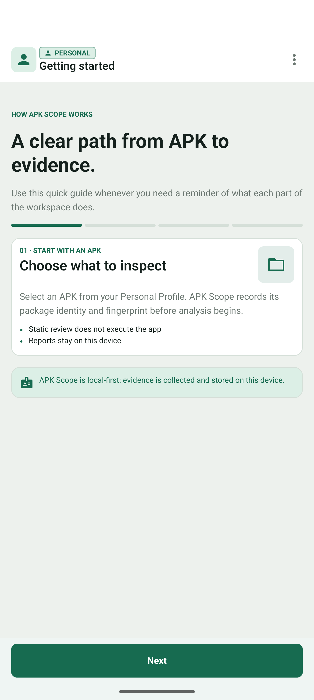

# APK Scope

APK Scope is a local-first Android security workbench for understanding what an APK declares and what it does when it runs. It combines static inspection with an optional Managed Work Profile session, network observation, evidence provenance, and deterministic reports—without root.

<table align="center">
  <tr>
    <td align="center" width="50%">
      <video src="https://github.com/user-attachments/assets/fc6780d0-efad-4e66-8ec7-88c7631283b2" controls muted playsinline width="340"></video>
      <br>
      🎬 <strong>CA / VPN full flow</strong> · 2:56<br>
      <sub>static analysis → Work Profile → VPN capture → decrypted HTTPS/WSS</sub>
    </td>
    <td align="center" width="50%">
      <video src="https://github.com/user-attachments/assets/0bb2540a-8ff2-4bac-96c5-ca755522b183" controls muted playsinline width="340"></video>
      <br>
      🎬 <strong>Frida full flow</strong> · 2:25<br>
      <sub>gadget patch → sandbox launch → SSL capture (no CA) → decoded HTTPS</sub>
    </td>
  </tr>
</table>

<p align="center">
  <sub>Press play on either clip above. Both are real captures on <code>emulator-5554</code> (Android 17 / API 37). Prefer a file? The MP4s live in <a href="docs/media/demo/">docs/media/demo/</a> and on the <a href="https://github.com/NadeemIqbal/apk-scope/releases/latest">latest release</a>, alongside the installable APK.</sub>
</p>

## 📥 Install

Grab the latest build from **[Releases](https://github.com/NadeemIqbal/apk-scope/releases/latest)** and sideload it:

```bash
adb install APK-Scope-v0.1.0-debug-signed.apk
```

Or copy the APK to an Android 11+ (API 30+) device and open it with a file manager. The published build is debug-signed for open sideloading; build a signed release yourself with `./gradlew :app:assembleRelease` if you prefer your own key.

> [!IMPORTANT]
> APK Scope is an explainability and evidence tool, not an antivirus, malware verdict, virtual machine, or guarantee of containment. A risk score is not malware probability. The Work Profile shares the Android kernel, and dynamic observation is limited by Android, device, app, and protocol behavior.

## Features

APK Scope walks a single APK from selection to signed, explainable evidence. Each capability below appears in the screenshots and the two full-flow recordings above.

### 🔍 Deterministic static analysis
Read package identity, manifest, signing, components, SDK config, native libraries, hashes, and bounded DEX signals — then score them with versioned, explainable rules (`static-v1`). Every finding keeps its source and precision (declaration vs. DEX presence vs. code reference).

<p align="center">
  
  
  
</p>

### 🛡️ Evidence-backed security audit
A separate rule catalog (`security-audit-v1`) grades each check as **Finding detected**, **Needs review**, or **Passed** with severity, confidence, and remediation — so an exported-component surface or an accessibility+overlay combination is explained, not just flagged.

<p align="center">
  
</p>

### 🧪 Managed Work Profile sandbox + VPN capture
Prepare a disposable Managed Work Profile, install the target through Android's own confirmation flow, and route it through a monitoring VPN with DNS attribution, IPv6 lockdown, and read-back verification of every applied restriction. Live Monitor shows connections, DNS/domain evidence, and byte counts as the target runs.

<p align="center">
  
  
</p>

### 🌐 Traffic Inspector with two inspection modes
Inspect readable HTTP/1.1 and negotiated HTTP/2 transactions, and choose how to see encrypted traffic:

- **CA Mode** — install the disposable Work Profile CA to decrypt HTTPS (and WSS) for apps that trust it. The CA flow above shows a decoded WebSocket `101` handshake with bidirectional frames and full HTTPS request/response bodies.
- **Frida Mode** — patch the APK with a Frida gadget that hooks `SSL_read`/`SSL_write` and streams the plaintext into APK Scope's inspector **without installing any CA**. The Frida flow above shows decoded HTTPS transactions captured straight from the instrumented app.

### 🧾 Signed, provenance-preserving reports
Every report keeps declared capabilities, observed behavior, and Android OS evidence distinct, with per-source completeness (`Complete` / `Not run` / `Not collected`) and a combined score. Runtime states are labeled honestly when no session supplied them, and reports persist locally across restarts.

<p align="center">
  
  
</p>

## What is verified today

| Capability | Status in this checkout |
| --- | --- |
| APK selection, manifest/package/signature inspection | Product path exercised |
| Deterministic static risk findings and security audit | Product path exercised |
| DEX coverage, embedded URL/API/SDK inspection | Product path exercised; bounded static coverage |
| Managed Work Profile lifecycle and target cleanup | Product verified on the documented device scope |
| VPN observation, destination policy, Android OS evidence | Product verified on the documented device scope |
| HTTP/1.1 and negotiated HTTP/2 inspection | Product verified for the documented compatible fixture path |
| Reports, evidence completeness, persistence after restart | Product verified for the documented device scope |
| CA-based HTTPS/WSS decryption in the Traffic Inspector | Demonstrated end-to-end on the documented emulator for a compatible fixture; subject to app trust and pinning |
| WebSocket/WSS, gRPC, SSE, QUIC/HTTP/3 | Component or research status; not advertised as release support |
| Frida/APK patching and gadget SSL capture | Development POC; full patch → run → capture flow demonstrated on the documented emulator, not the default workflow |

The screenshots show real static inspection of separately built fixtures selected through Android's document picker. The two full-flow recordings at the top are real emulator runs (`emulator-5554`, Android 17 / API 37); their verification boundaries are described below.

## Visual tour

The [Features](#features) section above shows the main screens in context. The remaining views — onboarding and the settings/protocol disclosures — round out the workspace:

<p align="center">
  
  
</p>

The visual set is intentionally honest: static findings and saved evidence are shown directly, while runtime states are labeled as pending or not run when no Work Profile session supplied them.

## Full-flow recordings

Both recordings were captured on `emulator-5554` (Android 17 / API 37), each as one continuous run from APK selection to a decoded transaction in the Traffic Inspector. Dead time between automated steps was trimmed; nothing was staged or synthesized, and no database row was inserted by hand. The looping previews at the top play the whole flow at speed; click either to open the full MP4 in GitHub's player, or stream both from the [latest release](https://github.com/NadeemIqbal/apk-scope/releases/latest).

### 🎬 CA / VPN full flow — [`apk-scope-ca-full-flow.mp4`](docs/media/demo/apk-scope-ca-full-flow.mp4) (2:56)

Choose APK → **CA Mode** → static analysis of the Harmless Sandbox Fixture → provision a disposable Managed Work Profile → prepare the sandbox and confirm the Android install → **Live Monitor** VPN evidence (connections, DNS/domain attribution, byte counts) → **Traffic Inspector**: install the Work Profile CA, enable HTTPS/WSS decryption, run the fixture, and read back a decoded WebSocket `101` handshake (bidirectional text/binary frames) and full HTTPS `200` request/response bodies.

This run **does** demonstrate plaintext HTTPS/WSS decryption, because the Work Profile CA was installed on camera. Decryption only works for apps that trust the test CA; certificate pinning, custom trust code, and unsupported protocols can still prevent readable payloads.

### 🎬 Frida full flow — [`apk-scope-frida-full-flow.mp4`](docs/media/demo/apk-scope-frida-full-flow.mp4) (2:25)

Choose APK → **Frida Mode** → the integrated patch pipeline injects a Frida gadget and re-signs the APK (note the changed signer) → static analysis of the patched APK → sandbox prepare/install → launch the patched app → its gadget hooks `SSL_read`/`SSL_write` and streams plaintext chunks into APK Scope's receiver (the receiver shows *Connected package* and a rising chunk count) → **Traffic Inspector** shows decoded HTTPS `200` transactions with readable headers and bodies.

The Frida path is a development POC, not the default workflow: it captures SSL bytes **without installing any CA**. Response bodies that arrive gzip-encoded appear as raw compressed bytes in the preview (the gadget captures the wire stream), while headers and uncompressed bodies decode cleanly.

The shorter clips from earlier verification runs remain in [`docs/media/demo/`](docs/media/demo/) for provenance and are catalogued in [the media manifest](docs/media/MANIFEST.md).

## Core workflow

1. **Select an APK in Personal.** APK Scope reads package metadata, manifest declarations, signing information, components, SDK configuration, native libraries, hashes, and bounded DEX signals.
2. **Review the static result.** Findings retain their source and precision (for example, declaration, DEX presence, or code reference). The score is deterministic and explainable.
3. **Optionally prepare a Work Profile session.** APK Scope installs the target through Android's normal confirmation flow, routes the Work Profile through its monitoring VPN, and keeps Personal and Work responsibilities separate.
4. **Observe and report.** Live network events, optional compatible HTTPS inspection, and asynchronous Android OS evidence are correlated to the session. Cleanup removes the target, imports bounded evidence, and preserves the report locally.

## Evidence model

| Evidence | What it means | What it does not prove |
| --- | --- | --- |
| `DeclaredCapability` | A manifest/header/DEX declaration or reference | That code executed or a permission was granted |
| `ObservedBehavior` | Activity captured by the Work Profile VPN/inspector | Behavior outside the capture scope |
| `AndroidEvidence` | An Android `DevicePolicyManager` network event | Complete network history or payload contents |
| Risk finding | A deterministic rule interpretation | Malware probability |

Static analysis, runtime observation, Android OS evidence, and inference remain distinct in the report. Exact URL claims require captured request evidence; a DNS lookup, host match, IP connection, or client response alone is not promoted to an exact observation.

## Try it locally

### Requirements

- Android 11 / API 30 or newer for the base app; Profile Owner network logging requires Android 12 / API 31 or newer.
- A physical device or emulator that supports Android Managed Profiles.
- JDK 17, Android SDK with `compileSdk 37`, and the checked-in Gradle wrapper.
- The app uses no root or privileged shell operations in its supported workflow.

### Build and install APK Scope

```bash
git clone https://github.com/NadeemIqbal/apk-scope.git apk-scope
cd apk-scope
./gradlew :app:assembleDebug
adb install app/build/outputs/apk/debug/app-debug.apk
```

Run the normal app flow to provision or connect to a Managed Work Profile. Android may require explicit user confirmation and device-specific setup.

### Build a fixture for selection

Fixtures are target APKs for inspection. Build one and copy it to Downloads; do not install the fixture in Personal, because that is not a sandbox demonstration and can prevent the Work Profile path from proceeding.

```bash
./gradlew :riskfixture:assembleDebug
adb push riskfixture/build/outputs/apk/debug/riskfixture-debug.apk \
  /sdcard/Download/APK-Scope-Risk-Fixture.apk
```

In APK Scope, choose **Choose APK**, select `APK-Scope-Risk-Fixture.apk` in the system picker, and review the static result. The fixture intentionally declares and exercises representative risky patterns, so its score is expected to be elevated. For a minimal baseline target, build and push `:fixture:assembleDebug` instead.

On first launch, Risk Signal Fixture copies bundled JSON and text examples into its private files directory and seeds synthetic SharedPreferences and SQLite rows. Use **Add runtime storage sample** to append a JSONL file entry and add corresponding preference/database records; repeat the action to create more entries.

## Optional runtime inspection

After static analysis, continue to **Configure Sandbox** only when a Managed Work Profile is available. The supported lifecycle uses Android's install/uninstall confirmations and includes target cleanup before evidence import.

- Use **Live Monitor** for bounded connection, DNS, byte-count, and policy-block evidence.
- Use **Traffic Inspector** for readable HTTP/1.1 or compatible negotiated HTTP/2 transactions, and for optional CA-based HTTPS inspection when the target explicitly trusts the test CA.
- Keep CA inspection visibly opt-in. Certificate pinning, custom trust code, encrypted DNS, unsupported protocols, and platform policy can prevent readable payloads.
- Before leaving cleanup, choose **Save dynamic analysis data** when that action is offered; runtime evidence is not implied by a static report.

## Risk score

Scores range from 0–100 and are calculated by versioned deterministic rule sets (`static-v1`, `runtime-v1`, and `combined-v1`). The current display uses Low (0–24), Moderate (25–49), High (50–74), and Critical (75–100). A high score means that the configured rules found risk-relevant declarations or observed behavior; it is not a claim that the APK is malicious.

See [docs/RISK_SCORING.md](docs/RISK_SCORING.md) for rule identifiers and weights.

## Privacy and boundaries

- APK metadata, observations, and reports are stored locally in the app's Room/SQLite stores by default. There is no APK Scope cloud upload.
- A target may still contact external services during a dynamic session if policy allows. “Local analysis” does not mean the target cannot send network traffic.
- Standard HTTPS metadata mode does not reveal encrypted payloads. Optional CA inspection is explicit, compatible-app-only, and subject to Android trust and pinning behavior.
- The Work Profile shares the Android kernel and one VPN slot per user/profile. IPv6 remains fail-closed in the current product scope.
- DPM logging is asynchronous and platform-dependent; absence of an event is not proof that no behavior occurred.

For the full security boundary, see [docs/LIMITATIONS.md](docs/LIMITATIONS.md), [docs/THREAT_MODEL.md](docs/THREAT_MODEL.md), and [docs/ARCHITECTURE.md](docs/ARCHITECTURE.md).

## Development

```bash
./gradlew projects
./gradlew testDebugUnitTest
./gradlew lintDebug
./gradlew :app:assembleDebug
```

The repository is now a single root-level Gradle project. Main source modules live in `app/`, `core/`, and the fixture directories; historical verification artifacts live in `evidence/`; current media lives in `docs/media/`.

## Roadmap

- Export bounded evidence as PCAP/HAR/JSON with explicit redaction and completeness metadata.
- Add session comparison and an evidence timeline.
- Expand gRPC/SSE/other protocol support only after real fixture-through-Work-Profile verification, ownership checks, persistence, and cleanup gates pass.
- Improve capture coverage reporting for encrypted, unsupported, truncated, and pending states.

## Repository governance

- [Contributing](CONTRIBUTING.md)
- [Security policy](SECURITY.md)
- [Third-party notices](THIRD_PARTY_NOTICES.md)
- [Apache License 2.0](LICENSE)
