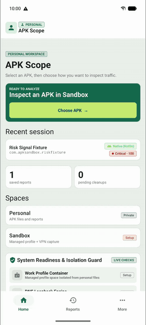
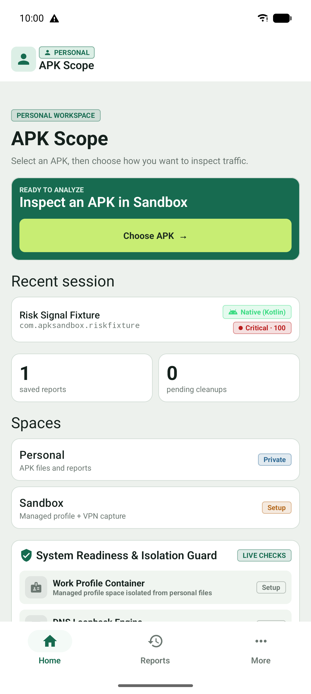
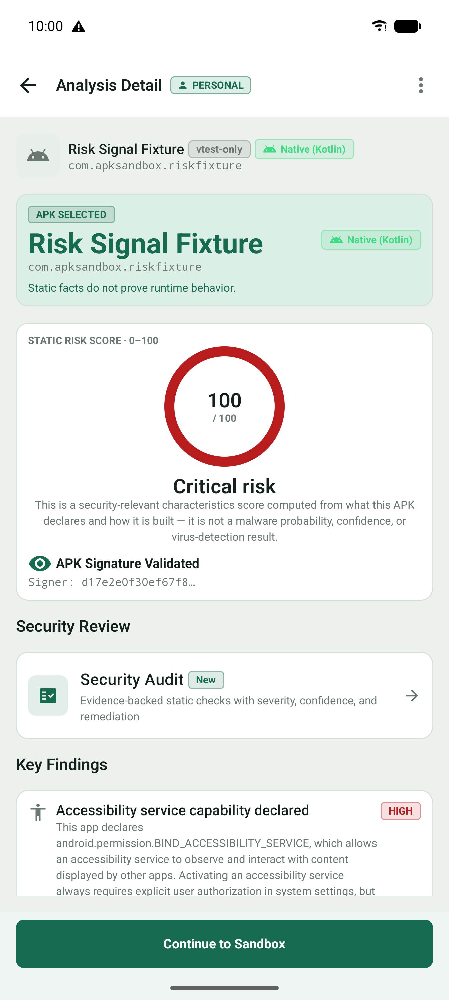
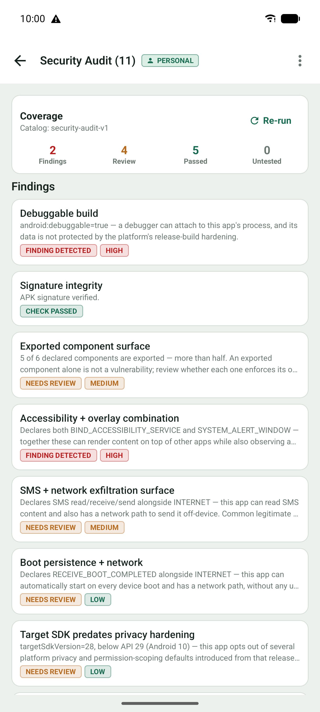
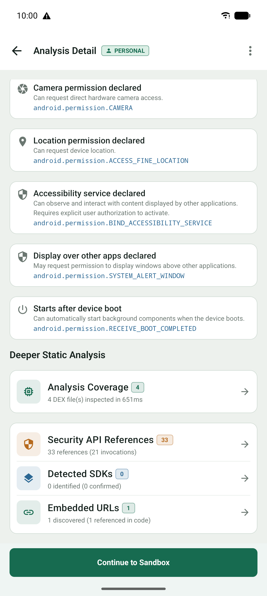
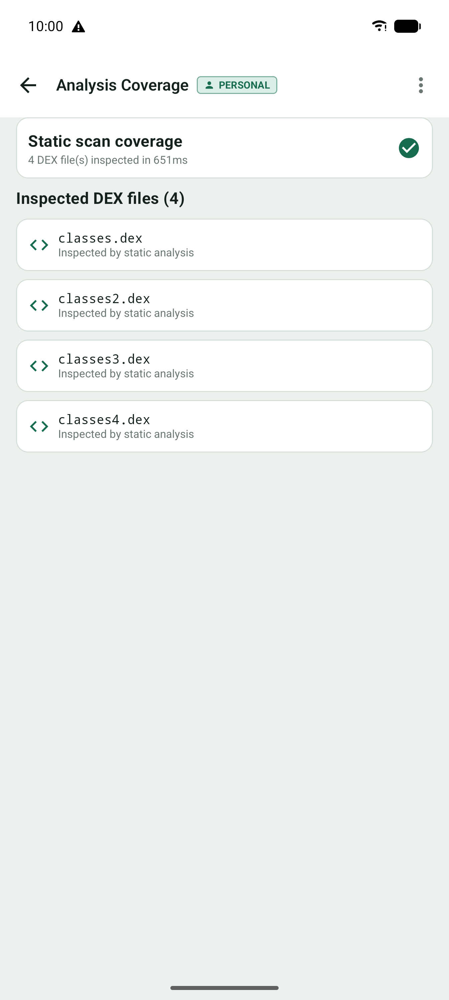
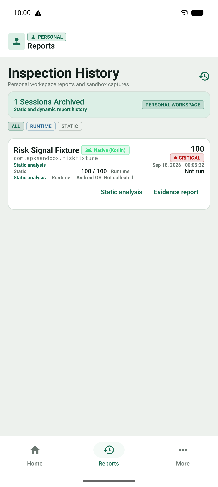
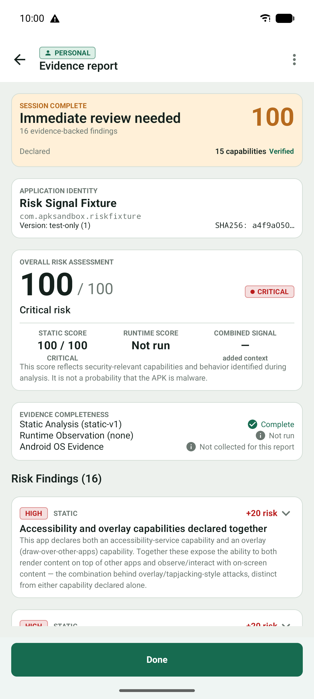
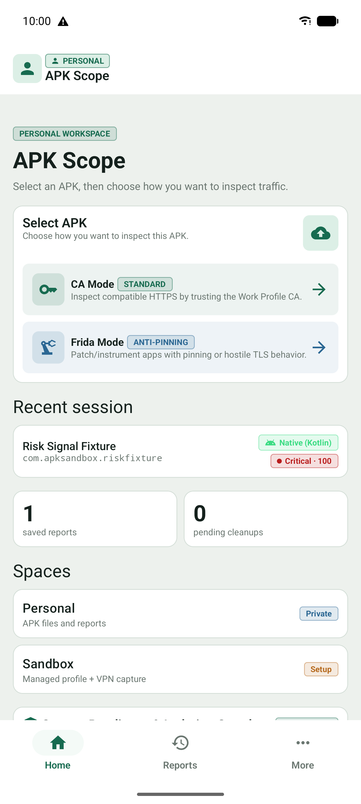
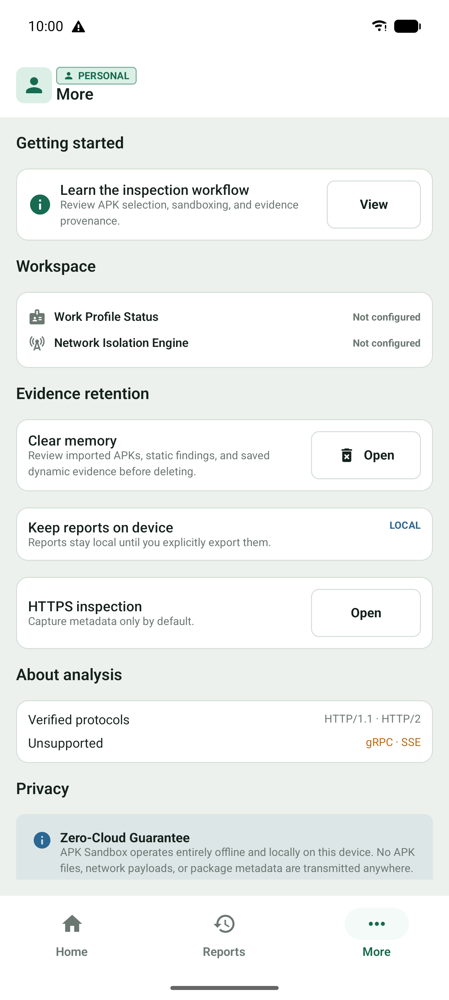

# APK Scope

APK Scope is a local-first Android security workbench for understanding what an APK declares and what it does when it runs. It combines static inspection with an optional Managed Work Profile session, network observation, evidence provenance, and deterministic reports—without root.

<p align="center">
  <a href="docs/media/demo/apk-scope-walkthrough.mp4">
    
  </a>
  <br>
  <em>Watch the <a href="docs/media/demo/apk-scope-walkthrough.mp4">24-second walkthrough</a>.</em>
</p>

> [!IMPORTANT]
> APK Scope is an explainability and evidence tool, not an antivirus, malware verdict, virtual machine, or guarantee of containment. A risk score is not malware probability. The Work Profile shares the Android kernel, and dynamic observation is limited by Android, device, app, and protocol behavior.

## What is verified today

| Capability | Status in this checkout |
| --- | --- |
| APK selection, manifest/package/signature inspection | Product path exercised |
| Deterministic static risk findings and security audit | Product path exercised |
| DEX coverage, embedded URL/API/SDK inspection | Product path exercised; bounded static coverage |
| Managed Work Profile lifecycle and target cleanup | Product verified on the documented device scope |
| VPN observation, destination policy, Android OS evidence | Product verified on the documented device scope |
| HTTP/1.1 and negotiated HTTP/2 inspection | Product verified for the documented compatible fixture path |
| Reports, evidence completeness, persistence after restart | Product verified for the documented device scope |
| WebSocket/WSS, gRPC, SSE, QUIC/HTTP/3 | Component or research status; not advertised as release support |
| Frida/APK patching | Development POC; not the default workflow |

The screenshots and original 24-second walkthrough show a real static inspection of the separately built **Risk Signal Fixture** selected through Android's document picker. The live recordings below are separate emulator runs and include their verification boundaries.

## Visual tour

<p align="center">
  
  
  
  <br>
  
  
  
  <br>
  
  
  
</p>

The visual set is intentionally honest: static findings and saved evidence are shown directly, while runtime states are labeled as pending or not run when no Work Profile session supplied them.

## Live verification recordings

These recordings were captured on `emulator-5554` (Android 17 / API 37). The CA clip uses a disposable Managed Work Profile; the Frida clip uses an installed patched fixture in Personal and APK Scope's standalone receiver.

- [CA/VPN network inspector](docs/media/demo/apk-scope-ca-network-inspector.mp4) — APK Scope's Traffic Inspector shows the CA-captured WSS `echo.websocket.org` handshake/messages and decoded HTTPS `jsonplaceholder.typicode.com` transaction.
- [Frida network inspector](docs/media/demo/apk-scope-frida-network-inspector.mp4) — an installed patched fixture streams real TLS bytes into APK Scope's standalone inspector; the recording filters the captured WSS handshake and decoded HTTPS transaction inside APK Scope, not the fixture's own log view.

The CA/VPN recording proves routed Work Profile traffic and DNS/domain attribution; it does **not** prove plaintext HTTPS decryption on that Work Profile run because the Work Profile CA was not installed. The Frida path is a development POC, not a release workflow: the patched fixture's TLS stream is received by APK Scope's standalone inspector, while the older pinned `httpbin.org` path remains a separate stale-pin limitation. WSS remains research-status and is shown only as captured inspector evidence, not a release-supported decrypted protocol.

## Core workflow

1. **Select an APK in Personal.** APK Scope reads package metadata, manifest declarations, signing information, components, SDK configuration, native libraries, hashes, and bounded DEX signals.
2. **Review the static result.** Findings retain their source and precision (for example, declaration, DEX presence, or code reference). The score is deterministic and explainable.
3. **Optionally prepare a Work Profile session.** APK Scope installs the target through Android's normal confirmation flow, routes the Work Profile through its monitoring VPN, and keeps Personal and Work responsibilities separate.
4. **Observe and report.** Live network events, optional compatible HTTPS inspection, and asynchronous Android OS evidence are correlated to the session. Cleanup removes the target, imports bounded evidence, and preserves the report locally.

## Evidence model

| Evidence | What it means | What it does not prove |
| --- | --- | --- |
| `DeclaredCapability` | A manifest/header/DEX declaration or reference | That code executed or a permission was granted |
| `ObservedBehavior` | Activity captured by the Work Profile VPN/inspector | Behavior outside the capture scope |
| `AndroidEvidence` | An Android `DevicePolicyManager` network event | Complete network history or payload contents |
| Risk finding | A deterministic rule interpretation | Malware probability |

Static analysis, runtime observation, Android OS evidence, and inference remain distinct in the report. Exact URL claims require captured request evidence; a DNS lookup, host match, IP connection, or client response alone is not promoted to an exact observation.

## Try it locally

### Requirements

- Android 11 / API 30 or newer for the base app; Profile Owner network logging requires Android 12 / API 31 or newer.
- A physical device or emulator that supports Android Managed Profiles.
- JDK 17, Android SDK with `compileSdk 37`, and the checked-in Gradle wrapper.
- The app uses no root or privileged shell operations in its supported workflow.

### Build and install APK Scope

```bash
git clone https://github.com/NadeemIqbal/apk-scope.git apk-scope
cd apk-scope
./gradlew :app:assembleDebug
adb install app/build/outputs/apk/debug/app-debug.apk
```

Run the normal app flow to provision or connect to a Managed Work Profile. Android may require explicit user confirmation and device-specific setup.

### Build a fixture for selection

Fixtures are target APKs for inspection. Build one and copy it to Downloads; do not install the fixture in Personal, because that is not a sandbox demonstration and can prevent the Work Profile path from proceeding.

```bash
./gradlew :riskfixture:assembleDebug
adb push riskfixture/build/outputs/apk/debug/riskfixture-debug.apk \
  /sdcard/Download/APK-Scope-Risk-Fixture.apk
```

In APK Scope, choose **Choose APK**, select `APK-Scope-Risk-Fixture.apk` in the system picker, and review the static result. The fixture intentionally declares and exercises representative risky patterns, so its score is expected to be elevated. For a minimal baseline target, build and push `:fixture:assembleDebug` instead.

## Optional runtime inspection

After static analysis, continue to **Configure Sandbox** only when a Managed Work Profile is available. The supported lifecycle uses Android's install/uninstall confirmations and includes target cleanup before evidence import.

- Use **Live Monitor** for bounded connection, DNS, byte-count, and policy-block evidence.
- Use **Traffic Inspector** for readable HTTP/1.1 or compatible negotiated HTTP/2 transactions, and for optional CA-based HTTPS inspection when the target explicitly trusts the test CA.
- Keep CA inspection visibly opt-in. Certificate pinning, custom trust code, encrypted DNS, unsupported protocols, and platform policy can prevent readable payloads.
- Before leaving cleanup, choose **Save dynamic analysis data** when that action is offered; runtime evidence is not implied by a static report.

## Risk score

Scores range from 0–100 and are calculated by versioned deterministic rule sets (`static-v1`, `runtime-v1`, and `combined-v1`). The current display uses Low (0–24), Moderate (25–49), High (50–74), and Critical (75–100). A high score means that the configured rules found risk-relevant declarations or observed behavior; it is not a claim that the APK is malicious.

See [docs/RISK_SCORING.md](docs/RISK_SCORING.md) for rule identifiers and weights.

## Privacy and boundaries

- APK metadata, observations, and reports are stored locally in the app's Room/SQLite stores by default. There is no APK Scope cloud upload.
- A target may still contact external services during a dynamic session if policy allows. “Local analysis” does not mean the target cannot send network traffic.
- Standard HTTPS metadata mode does not reveal encrypted payloads. Optional CA inspection is explicit, compatible-app-only, and subject to Android trust and pinning behavior.
- The Work Profile shares the Android kernel and one VPN slot per user/profile. IPv6 remains fail-closed in the current product scope.
- DPM logging is asynchronous and platform-dependent; absence of an event is not proof that no behavior occurred.

For the full security boundary, see [docs/LIMITATIONS.md](docs/LIMITATIONS.md), [docs/THREAT_MODEL.md](docs/THREAT_MODEL.md), and [docs/ARCHITECTURE.md](docs/ARCHITECTURE.md).

## Development

```bash
./gradlew projects
./gradlew testDebugUnitTest
./gradlew lintDebug
./gradlew :app:assembleDebug
```

The repository is now a single root-level Gradle project. Main source modules live in `app/`, `core/`, and the fixture directories; historical verification artifacts live in `evidence/`; current media lives in `docs/media/`.

## Roadmap

- Export bounded evidence as PCAP/HAR/JSON with explicit redaction and completeness metadata.
- Add session comparison and an evidence timeline.
- Expand gRPC/SSE/other protocol support only after real fixture-through-Work-Profile verification, ownership checks, persistence, and cleanup gates pass.
- Improve capture coverage reporting for encrypted, unsupported, truncated, and pending states.

## Repository governance

- [Contributing](CONTRIBUTING.md)
- [Security policy](SECURITY.md)
- [Third-party notices](THIRD_PARTY_NOTICES.md)
- [Apache License 2.0](LICENSE)
